# Reactive web app + AWS-Cli

## Objetivos
	1. Desarrollo de una aplicación básica web reactiva.
	2. Crear un Script que automatice:
		a) Crear 3 instancias de EC2 en AWS
		b) Preparar las instancias
		c) Desplegar la aplicación en las instancias
		d) Correr la aplicación en las instancias
		
## Solución implementada
	Para la aplicación web se ha utilizado el framework Spring WebFlux.
	Este permite crear una aplicación web reactiva, donde una de sus principales
	funcionalidades de Spring WebFlux es proveer un framework no bloqueante es decir asincrono.
	
	Para este caso se pueden realizar multiples peticiones, este por debajo
	consulta un Mock de persistencia con algunas facturas y personas creadas.
	La ventaja de trabajar con esto, es que si cada petición toma 3 segundos, esos 3 segundos serán
	el total a esperar, por el contrario si no fuera aplicación web reactiva, se demoraría
	6 segundos, pues cada petición debería esperar la respuesta de la otra.
	
	
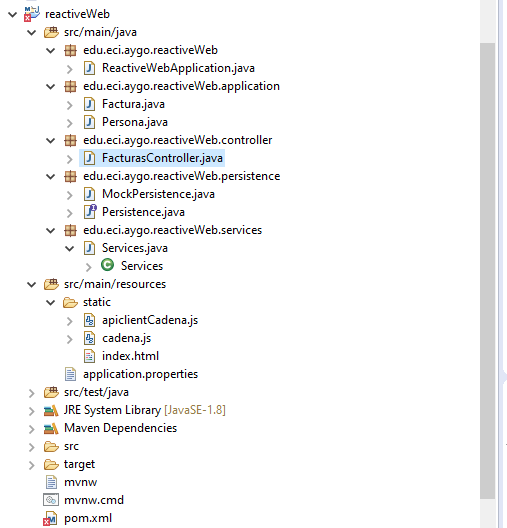		

	Se ha utilizado para el proyecto los siguientes paquetes:
		Controller: Encargado de recibir las peticiones del servicio web.
		Services: La clase encargada de consultar la persistencia.
		Persistence: Tiene una clase abstracta y un mock que implementa dicha clase abstracta, el cuál
		tiene una lista Flux de facturas quemadas.
		Application: Contiene la clase Factura.
		

	Se ha utilizado Docker para empaquetar la aplicación. Se utiliza un DockerFile 
	para generar la aplicación.
	Se ha subido la imagen a dockerhub. juanarevalomerchan/aygo_reactive_web_services
	
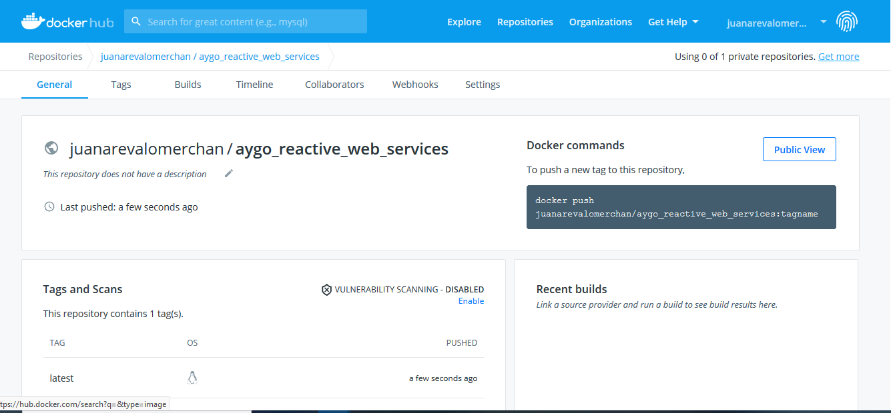	

## AWS-CLI

### Pre-requisitos
	1. Tener instalado AWS-Cli
	2. Configurar AWS-Cli
		$ aws configure
		AWS Access Key ID [None]: {KeyId}
		AWS Secret Access Key [None]: {SecretAccesKey}
		Default region name [None]: us-east-1
		Default output format [None]: json	
		
### Script
	El Script se ha creado para ejecutar con consola bash.
	Realiza las siguientes acciones.
	
	1. Crear una llave .pem para generar la conexión
	2. Cambiar los permisos a la llave creada
	3. Crear un grupo de seguridad.
	4. Añadir permisos al grupo de seguridad para recibir conexiones por ssh sobre el puerto 22.
	5. Añadir permisos al grupo de seguridad para recibir peticiones por el puerto 8080 
	   (Puerto de la aplicación web TCP)
	6. Crear 3 instancias EC2.
	7. Consulta las instacias creadas dentro del grupo de seguridad mencionado anteriormente.
	   Las escribe en un archivo json llamado instancias.json	
	8. Por cada instancia busca el dns
	9. Por cada instancia se conecta por ssh, para actualizar, descargar docker, iniciar docker
	   y ejecutar una instancia de la imagen de dockerhub creada anteriormente.	
	
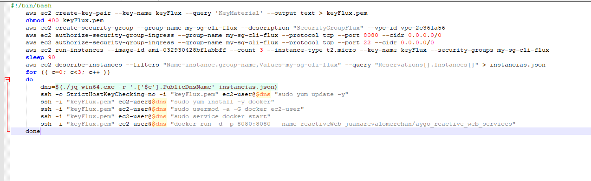	

### Ejecución
	1. Ejecucuión del Script + Creación del Grupo de Seguridad
	
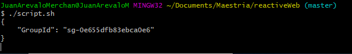	

	2. Creación de las instancias EC2
	
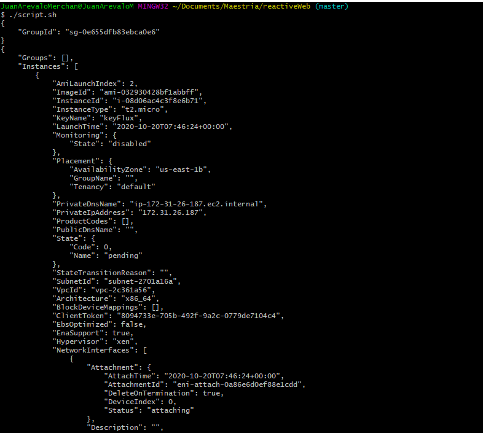	
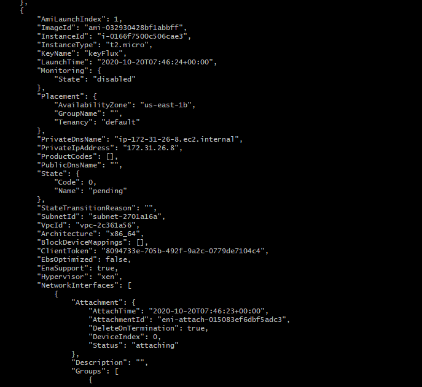	
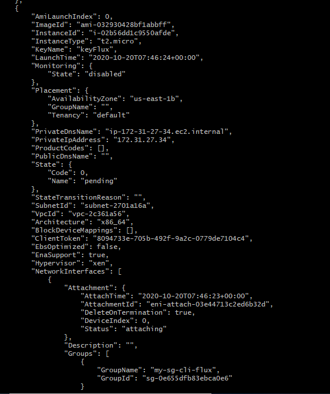		
	
	3. Conexión SSH e Instalación de Docker	
	
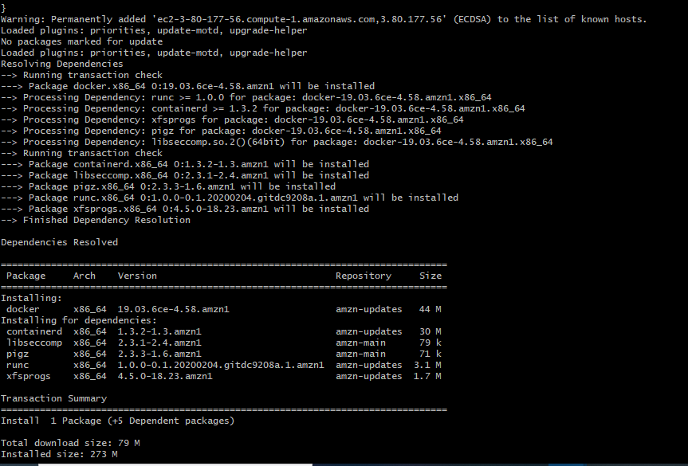	

	4. Descarga Imagen Docker y Ejecución
	
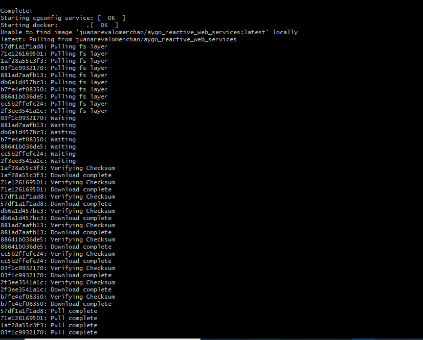	

	5. Instancias en AWS
	
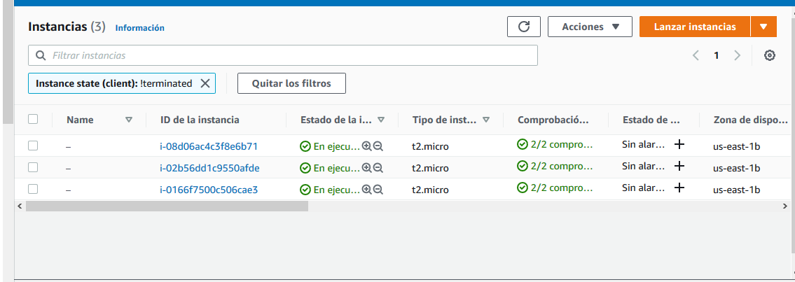	

	6. Validación Ejecución Aplicación
	
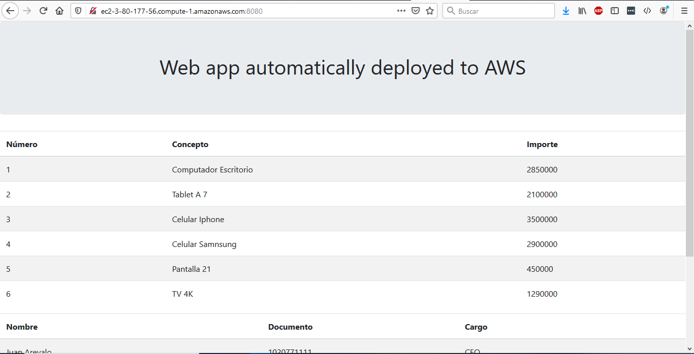
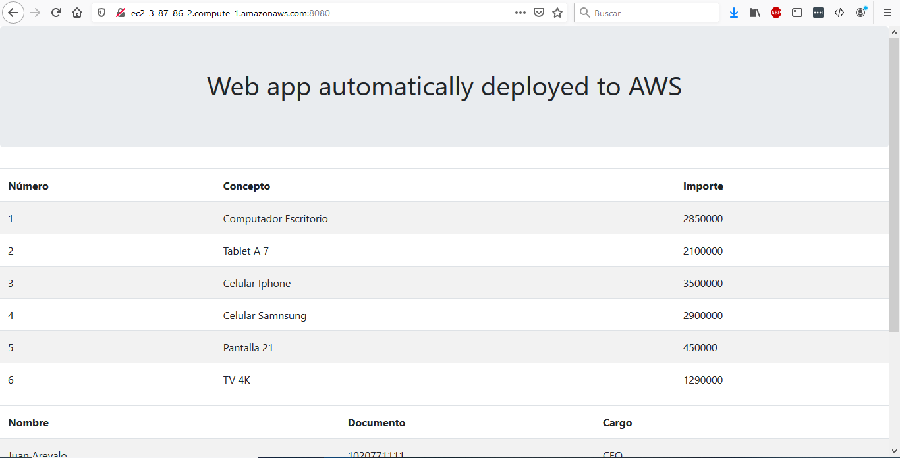
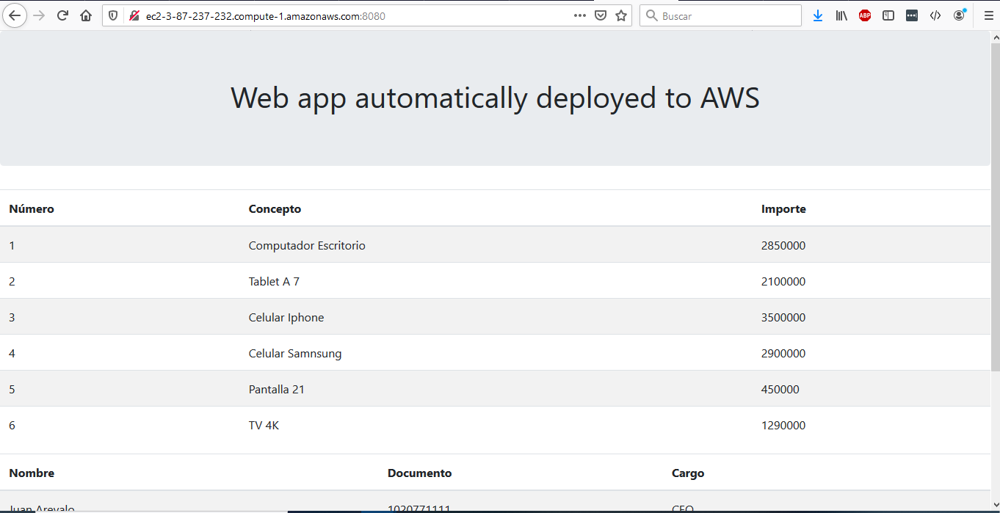	
	
	
		
	
	
	