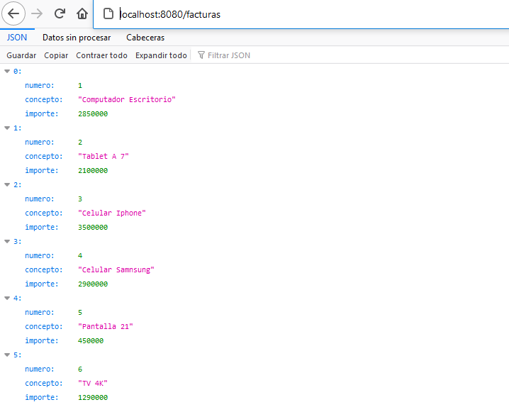

# Reactive web app + AWS-Cli

## Objetivos
	1. Desarrollo de una aplicación básica web reactiva.
	2. Crear un Script que automatice:
		a) Crear 3 instancias de EC2 en AWS
		b) Preparar las instancias
		c) Desplegar la aplicación en las instancias
		d) Correr la aplicación en las instancias
		
## Solución implementada
	Para la aplicación web se ha utilizado el framework Spring WebFlux.
	Este permite crear una aplicación web reactiva, donde una de sus principales
	funcionalidades de Spring WebFlux es proveer un framework no bloqueante es decir asincrono.
	
	Para este caso se pueden realizar multiples peticiones get a la url /facturas, este por debajo
	consulta un Mock de persistencia con algunas facturas creadas.
	
	
	